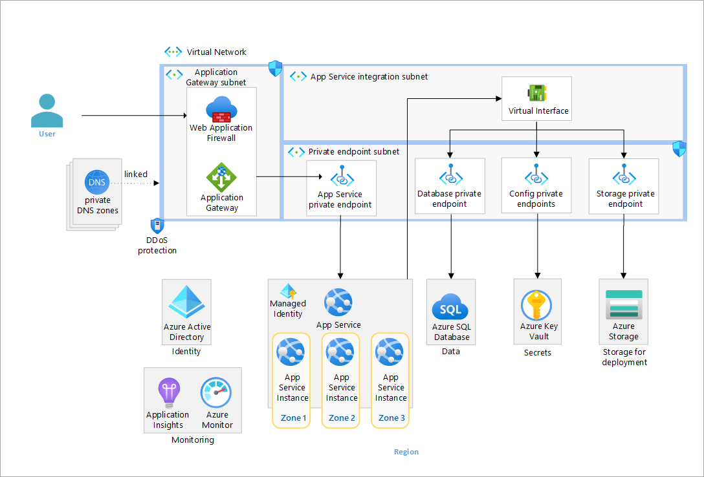

# WIP - Baseline highly available zone-redundant web application



[Baseline highly available zone-redundant web application](https://learn.microsoft.com/en-us/azure/architecture/web-apps/app-service/architectures/baseline-zone-redundant)

> [!NOTE]
> This is a work in progress. Some features may not be fully implemented or may not work as expected. For example, app connection strings are set up but test is not working yet. WAF and DDoS protection are not implemented yet. Feel free to contribute to this project by submitting issues or pull requests.


After deployment you need to make this steps by hand:

1. Check the managed identity of the web app and give it access to the mssql server , this must be done in the portal, you can use the following command to get the identity name:
    ```bash
    # Set the variables
    resourceGroupName=<resource-group-name>
    webappName=<webapp-name>

    # Get the identity name
    az webapp identity show --name $webappName --resource-group $resourceGroupName --query principalId
    ```
    For example:

    ```bash
    # Set the variables
    resourceGroupName=fhjh-rg-webapp
    webappName=example-webapp1417
    # Get the identity name
    az webapp identity show --name $webappName --resource-group $resourceGroupName --query principalId
    # Output
    {
      "principalId": null,
      "tenantId": null,
      "type": "UserAssigned",
      "userAssignedIdentities": {
        "/subscriptions/00000000-0000-0000-0000-000000000000/resourceGroups/resourcegroups/fhjh-rg-webapp/providers/Microsoft.ManagedIdentity/userAssignedIdentities/fhjh-msi-example_db_mi": {
          "clientId": "c0c27e05-3014-4bb4-851b-9df3ce4a83ac",
          "principalId": "6adb5d25-73c6-4ca8-8642-892829c3e6f0"
        }
      }
    }
    ```


2. Access the mssql server with Query editor by portal and create a user for the web app:
    ```sql
    CREATE USER [<identity-name>] FROM EXTERNAL PROVIDER;
    ALTER ROLE db_datareader ADD MEMBER [<identity-name>];
    ALTER ROLE db_datawriter ADD MEMBER [<identity-name>];
    ALTER ROLE db_ddladmin ADD MEMBER [<identity-name>];
    ```

    For example:

    ```sql
    CREATE USER [fhjh-msi-example_db_mi] FROM EXTERNAL PROVIDER;
    ALTER ROLE db_datareader ADD MEMBER [fhjh-msi-example_db_mi];
    ALTER ROLE db_datawriter ADD MEMBER [fhjh-msi-example_db_mi];
    ALTER ROLE db_ddladmin ADD MEMBER [fhjh-msi-example_db_mi];
    ```

